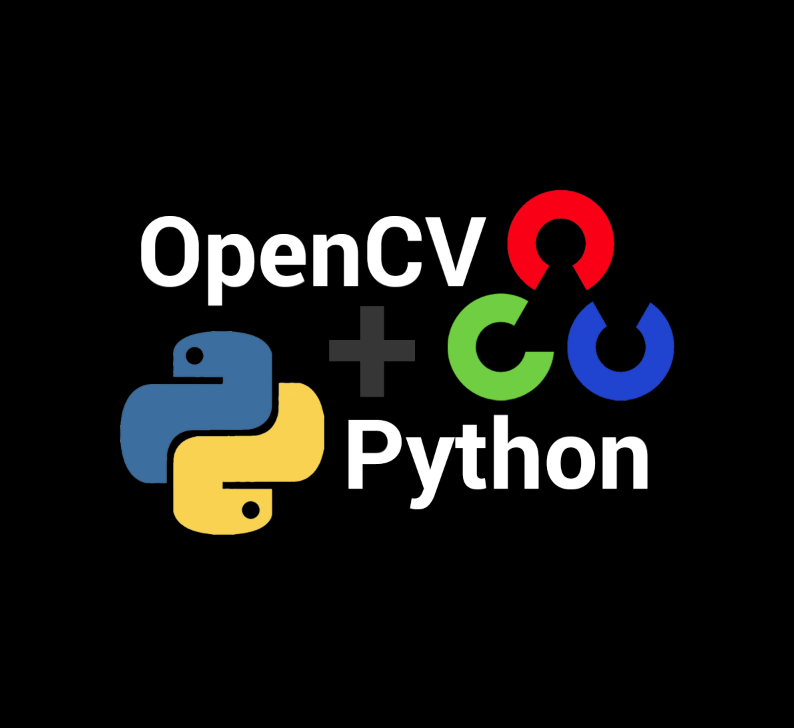

# Fundamentos de Visão Computacional e Processamento de Imagens com OpenCV
<div align="center">
      
</div>  


## Sobre o Repositório

Este repositório reúne um conjunto de atividades práticas desenvolvidas durante a Pós-Graduação em Inteligência Artificial e Aprendizado de Máquina na PUC Minas, com foco na construção de fundamentos sólidos em Visão Computacional utilizando a biblioteca OpenCV.

Ao longo dos notebooks são exploradas técnicas essenciais de processamento digital de imagens, incluindo manipulação de pixels, transformações geométricas, análise de histogramas, filtragem espacial, detecção de bordas, correção de perspectiva e pré-processamento para aplicações de OCR e reconhecimento visual.

O objetivo é demonstrar competências fundamentais utilizadas em pipelines de Visão Computacional aplicados a sistemas inteligentes baseados em imagens.

---

## Objetivos

- Compreender a representação digital de imagens;
- Manipular pixels e regiões de interesse (ROI);
- Trabalhar com diferentes espaços de cor (RGB, BGR e HSV);
- Aplicar técnicas de melhoria de contraste;
- Realizar análise de histogramas;
- Executar transformações geométricas em imagens;
- Implementar filtros para redução de ruído;
- Detectar bordas e contornos;
- Aplicar correção de perspectiva;
- Preparar imagens para sistemas de OCR e reconhecimento visual.

---

## Conteúdo do Repositório

### 1. Fundamentos de Manipulação de Imagens

Neste notebook são apresentados os conceitos básicos de imagens digitais utilizando OpenCV.

**Principais tópicos abordados:**

- Leitura e exibição de imagens;
- Conversão entre RGB e BGR;
- Conversão para escala de cinza;
- Manipulação direta de pixels;
- Regiões de interesse (ROI);
- Extração de propriedades das imagens;
- Simulação de detecção facial utilizando bounding boxes.

📘 Notebook: 

**Notebook:**[ 01_opencv_manipulacao_imagens.ipynb](https://github.com/deivison1983/Visao_Computacional_OpenCV/blob/main/notebooks/01_opencv_manipulacao_imagens.ipynb)

---

### 2. Análise de Histogramas e Espaço de Cor HSV

Este notebook explora técnicas de análise visual e melhoria de imagens.

**Principais tópicos abordados:**

- Conversão RGB → HSV;
- Separação dos canais Hue, Saturation e Value;
- Manipulação de saturação;
- Construção de histogramas;
- Análise de distribuição de pixels;
- Equalização de histogramas;
- Melhoria de contraste em imagens coloridas e tons de cinza.

📘 Notebook:

**Notebook:**[ 02_opencv_histogramas_espaco_cor_hsv.ipynb](https://github.com/deivison1983/Visao_Computacional_OpenCV/blob/main/notebooks/02_opencv_histogramas_espaco_cor_hsv.ipynb)

---

### 3. Transformações Geométricas e Processamento Avançado

Neste módulo são aplicadas técnicas intermediárias amplamente utilizadas em sistemas de Visão Computacional.

**Principais tópicos abordados:**

- Redimensionamento;
- Translação;
- Rotação;
- Correção de perspectiva;
- Filtros de suavização;
- Filtros de nitidez;
- Detecção de bordas (Canny e Laplaciano);
- Operações com máscaras;
- Pré-processamento para OCR;
- Filtragem bilateral e convolução customizada.

📘 Notebook:

**Notebook:**[ 03_opencv_transf_geometricas_processamento.ipynb](https://github.com/deivison1983/Visao_Computacional_OpenCV/blob/main/notebooks/03_opencv_transf_geometricas_processamento.ipynb)

---

## Bibliotecas Utilizadas

- Python
- OpenCV
- NumPy
- Matplotlib

---

## Competências Demonstradas

### Visão Computacional

- Processamento Digital de Imagens
- Manipulação de Espaços de Cor
- Segmentação de Regiões de Interesse
- Correção de Perspectiva
- Detecção de Bordas
- Pré-processamento para OCR

### Programação e Ciência de Dados

- Python
- NumPy
- Manipulação Matricial
- Visualização de Dados
- Desenvolvimento de Pipelines de Processamento

### Engenharia de Imagens

- Equalização de Histograma
- Redução de Ruído
- Filtragem Espacial
- Convolução
- Operações Bitwise

---

## Estrutura do repositório

```text
Visao_Computacional_OpenCV/
│
├── notebooks/
│   ├── 01_opencv_manipulacao_imagens.ipynb
│   ├── 02_opencv_histogramas_espaco_cor_hsv.ipynb
│   └── 03_opencv_transf_geometricas_processamento.ipynb
│
├── data/imagem/
│
└── README.md
```

---

## Aplicações Práticas

As técnicas implementadas neste projeto são amplamente utilizadas em:

- OCR (Reconhecimento Óptico de Caracteres);
- Inspeção visual automatizada;
- Controle de qualidade industrial;
- Sistemas de monitoramento;
- Reconhecimento de padrões;
- Pré-processamento para modelos de Deep Learning;
- Sistemas de Visão Computacional embarcados.

---

## Próximos Passos

Os conceitos apresentados neste projeto servem como base para aplicações mais avançadas envolvendo:

- Deep Learning para Visão Computacional;
- Redes Neurais Convolucionais (CNN);
- Detecção de Objetos;
- Segmentação Semântica;
- Reconhecimento Facial;
- Sistemas Inteligentes de Monitoramento.

---

## Autor

Deivison Morais. Visite o meu portfólio de projetos [aqui.](https://deivison1983.github.io/portfolio_projetos/)

Pós-Graduação em Inteligência Artificial e Aprendizado de Máquina - PUC Minas

Professor Orientador: Octavio Santana

### Contatos

<div>
  <a href = "https://www.linkedin.com/in/deivisonmorais/"></a>
  <a href = "mailto:deivison1983@gmail.com"></a>
</div>
